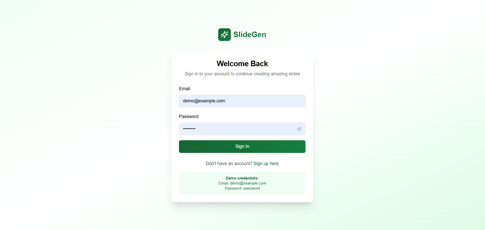
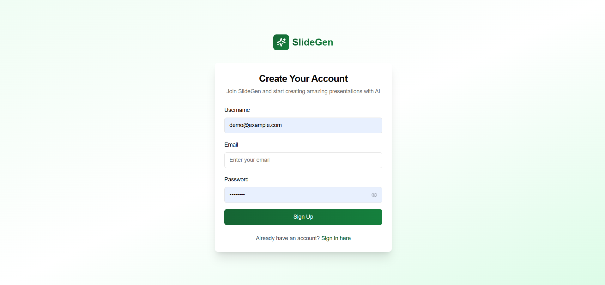
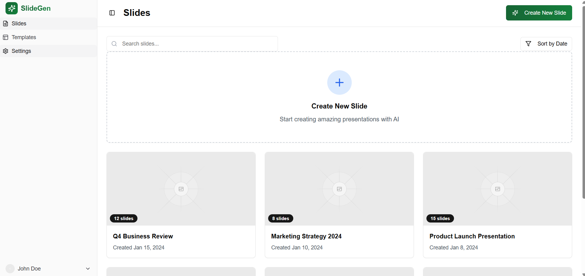
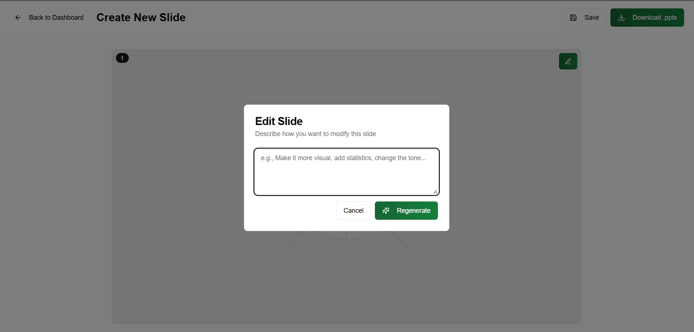
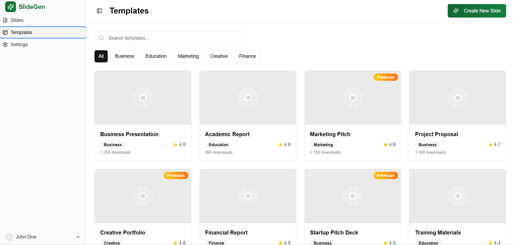

# SLideGen

## Screenshots

| Landing Page | Sign In | Sign Up |
|---|---|---|
|  |  |  |

| Dashboard | Create Slide | Edit Slide |
|---|---|---|
|  |  |  |

| Template | Preview Slide | Settings |
|---|---|---|
|  |  |  |

## 1. Installation
```bash
pnpm install
```

## 2. Dev
```bash
pnpm run dev
```

## 3. Build
```bash
pnpm run build
```

## 4. Start
```bash
pnpm run start
```
